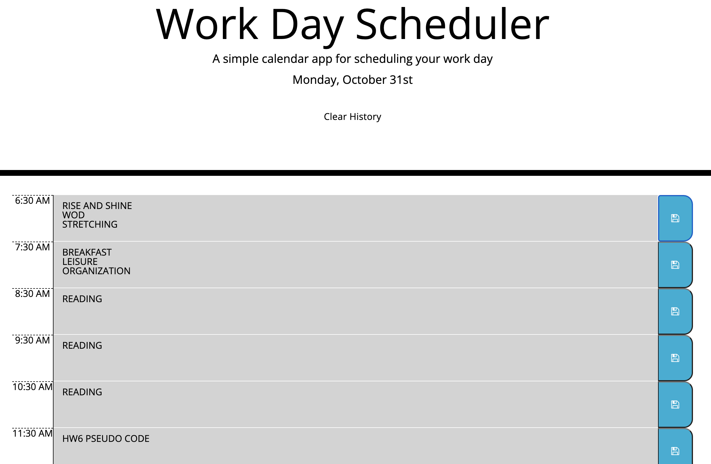

# daily-organiz

## Table of Contents
* [Description](#description)
* [Photos](#photos)
* [Credits](#credits)
* [License](#license)
* [Deployed Page](#deployed-page)
* [Contact](#contact)

## Description
A day planner app that uses local storage to save events and changes the time block's color based on the time of day.

## Photos

## License
Please refer to the LICENSE in the repo.

## Deployed Page
<a href="https://emiliatrentham.github.io/daily-organiz/">Deployed Application Link</a> 

## Contact
<a href="https://www.linkedin.com/in/emilia-trentham-987a59164/" >LinkedIn: Emilia Trentham</a>

<a href="https://github.com/emiliatrentham%22%3EGithub:">GitHub: emiliatrentham</a>

